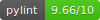

# Auto Observability




Система автоматического мониторинга Docker-контейнеров с генерацией конфигураций Prometheus на основе автоматической классификации технологического стека.

## Технологический стек


## Описание

Auto Observability — это платформа для автоматического обнаружения, классификации и мониторинга Docker-контейнеров в распределенной инфраструктуре. Система автоматически определяет технологический стек каждого контейнера и генерирует соответствующие конфигурации Prometheus с запуском необходимых экспортеров.

### Основные возможности

- Автоматическое обнаружение контейнеров на множестве хостов
- Интеллектуальная классификация технологического стека контейнеров
- Автоматическая генерация конфигураций Prometheus
- Управление экспортерами метрик
- Централизованное хранение конфигураций в MinIO
- Веб-интерфейс для управления и мониторинга
- Фоновые задачи для автоматического обновления данных


### Поток данных

1. **Обнаружение контейнеров**: API Aggregator запрашивает контейнеры через Docker API на каждом хосте
2. **Классификация**: Каждый контейнер отправляется в Classification API для определения технологического стека
3. **Хранение**: Данные о контейнерах кешируются в Redis, метаданные сохраняются в PostgreSQL
4. **Генерация конфигурации**: При запросе Prometheus Generation API создает конфигурацию на основе классификации
5. **Сохранение**: Конфигурации сохраняются в MinIO для последующего использования Prometheus
6. **Запуск экспортера**: Система автоматически запускает соответствующий экспортер в той же Docker-сети

## Сервисы

### API Aggregator

**Порт**: 8081  
**Технологии**: FastAPI, PostgreSQL, Redis, Celery

Центральный сервис-агрегатор, предоставляющий единый API для всех операций системы.

**Основные функции**:
- Управление хостами (добавление, обновление, удаление)
- Управление контейнерами (получение списка, запуск, остановка, удаление)
- Генерация конфигураций Prometheus
- Запуск экспортеров метрик
- Управление подписями (signatures) для классификации
- Получение всех активных конфигураций

**Роутеры**:
- `/api/v1/containers` — управление контейнерами
- `/api/v1/prometheus` — управление конфигурациями Prometheus
- `/api/v1/hosts` — управление хостами

**Фоновые задачи (Celery)**:
- Обновление информации о контейнерах (каждую минуту)
- Обновление информации о хостах (каждые 15 секунд)

**Базы данных**:
- PostgreSQL: метаданные контейнеров, хостов, конфигураций Prometheus
- Redis: кеш данных о контейнерах и хостах

### Docker API

**Порт**: 8000
**Технологии**: FastAPI, Docker SDK

Сервис для взаимодействия с Docker daemon на удаленных хостах.

**Основные функции**:
- Обнаружение всех контейнеров на хосте
- Управление жизненным циклом контейнеров (start, stop, remove)
- Запуск новых контейнеров (pull and run)
- Получение детальной информации о контейнерах

**Роутеры**:
- `/api/v1/discover` — обнаружение контейнеров
- `/api/v1/manage` — управление контейнерами

**Особенности**:
- Работает напрямую с Docker SDK
- Поддерживает подключение к удаленным Docker daemons
- Автоматическое определение сетей контейнеров

### Docker Classification

**Порт**: 8083  
**Технологии**: FastAPI, PyYAML

Сервис для автоматической классификации технологического стека контейнеров.

**Основные функции**:
- Анализ меток (labels) контейнера
- Анализ переменных окружения (env)
- Анализ образа (image)
- Анализ открытых портов
- Взвешенная система оценки для определения стека

**Алгоритм классификации**:
- Использует файл `docker_classification/app/services/signatures.yml` с правилами классификации
- Каждое правило имеет вес (weight)
- Система суммирует веса по всем признакам
- Возвращает отсортированный список технологий с вероятностями

**Роутеры**:
- `/api/v1/classificate` — классификация контейнера

**Поддерживаемые технологии**:
- Базы данных: PostgreSQL, MySQL, MongoDB, Redis, Cassandra и др.
- Message brokers: RabbitMQ, Kafka, NATS, ActiveMQ
- Web-серверы: Nginx, Apache, Caddy
- Application servers: Tomcat, Jetty, WildFly
- И многие другие

### Prometheus Generation

**Порт**: 8084  
**Технологии**: FastAPI, MinIO (S3), PyYAML

Сервис для генерации конфигураций Prometheus на основе классификации контейнеров.

**Основные функции**:
- Генерация scrape_config для Prometheus
- Генерация targets файла
- Создание переменных окружения для экспортеров
- Определение Docker-сети для экспортера
- Сохранение конфигураций в MinIO

**Роутеры**:
- `/api/v1/generate` — генерация конфигурации
- `/api/v1/signature` — управление подписями

**Конфигурация экспортеров**:
- Использует файл `signatures.yml` в корне проекта для настройки экспортеров Prometheus
- Файл содержит конфигурации портов, образов и переменных окружения для каждого типа стека
- При запуске в Docker файл монтируется в контейнер как `/app/signatures.yml`

**Формат конфигурации**:
- `scrape_config.yml` — конфигурация для Prometheus
- `targets.yml` — список целей для скрейпинга

**Хранение**:
- Конфигурации сохраняются в MinIO (S3-совместимое хранилище)
- Организация по контейнерам: `prometheus/{container_id}/`

### Frontend

**Порт**: 5173 (dev), 4173 (build)  
**Технологии**: Vue.js 3, TypeScript, Vite, CodeMirror

Веб-интерфейс для управления системой мониторинга.

**Основные функции**:
- Просмотр списка хостов и их статусов
- Просмотр контейнеров с фильтрацией по хостам
- Детальная информация о контейнерах
- Генерация конфигураций Prometheus
- Запуск экспортеров метрик
- Просмотр и редактирование signatures
- Просмотр всех активных конфигураций
- Просмотр файлов конфигураций из MinIO

**Компоненты**:
- `ContainerList` — список контейнеров
- `ContainerDetails` — детали контейнера
- `ExporterControl` — управление экспортерами
- `PrometheusConfig` — просмотр конфигураций
- `HostsView` — управление хостами

## Установка и запуск

### Требования

- Python 3.11+
- Node.js 18+
- Docker и Docker Compose
- PostgreSQL 15+
- Redis 7+
- MinIO (или S3-совместимое хранилище)

### Структура проекта

```
Auto_Observability/
├── signatures.yml                    # Конфигурация экспортеров Prometheus (в корне проекта)
├── docker-compose.yml                # Docker Compose конфигурация
├── run-dev.sh                        # Скрипт для локальной разработки
├── api_agregator/                    # API Aggregator сервис
├── docker_api/                       # Docker API сервис
├── docker_classification/            # Docker Classification сервис
├── prometheus_generation/            # Prometheus Generation сервис
├── prometheus_manager/               # Prometheus Manager сервис
└── frontend/                         # Frontend приложение
```

### Настройка окружения

Создайте файлы `.env.dev` в каждом сервисе для локальной разработки:

**api_agregator/.env.dev**:
```env
POSTGRES_HOST=localhost
POSTGRES_PORT=5433
POSTGRES_USER=postgres
POSTGRES_PASSWORD=postgres
POSTGRES_DB=auto_observability
REDIS_HOST=localhost
REDIS_PORT=6379
REDIS_DB=0
CELERY_BROKER_URL=redis://localhost:6379/1
CELERY_RESULT_BACKEND=redis://localhost:6379/2
MINIO_ENDPOINT=http://localhost:9002
MINIO_USR=minioadmin
MINIO_PWD=minioadmin
DOCKER_API_URL=http://localhost:8000
DOCKER_CLASSIFICATION_API_URL=http://localhost:8001
PROMETHEUS_GENERATION_URL=http://localhost:8002
PROMETHEUS_MANAGER_URL=http://localhost:8003
```

**frontend/.env.dev**:
```env
VITE_API_URL=http://localhost:8081
```

Аналогично создайте `.env.dev` файлы для остальных сервисов (`prometheus_generation`, `prometheus_manager`, `docker_classification`).

### Установка зависимостей

**Backend сервисы**:
```bash
cd api_agregator && pip install -r requirements.txt
cd docker_api && pip install -r requirements.txt
cd docker_classification && pip install -r requirements.txt
cd prometheus_generation && pip install -r requirements.txt
```

**Frontend**:
```bash
cd frontend && npm install
```

### Инициализация базы данных

```bash
cd api_agregator
python -m app.db.postgres.init_db
```

### Запуск сервисов

**Локальная разработка (рекомендуется)**:
```bash
./run-dev.sh start
```

Скрипт `run-dev.sh` автоматически:
- Запускает инфраструктуру (PostgreSQL, Redis, MinIO) через Docker Compose
- Инициализирует базу данных
- Запускает все микросервисы с их `.env.dev` файлами
- Запускает Celery worker и beat
- Запускает frontend

**Остановка сервисов**:
```bash
./run-dev.sh stop
```

**Запуск через Docker Compose**:
```bash
docker-compose up -d
```

**Ручной запуск отдельных сервисов** (для отладки):

API Aggregator:
```bash
cd api_agregator
source .env.dev 2>/dev/null || true
uvicorn app.main:app --host 0.0.0.0 --port 8081 --reload
```

Celery Worker:
```bash
cd api_agregator
source .env.dev 2>/dev/null || true
celery -A app.celery_app worker --loglevel=info
```

Celery Beat:
```bash
cd api_agregator
source .env.dev 2>/dev/null || true
celery -A app.celery_app beat --loglevel=info
```

Docker API:
```bash
cd docker_api
source .env.dev 2>/dev/null || true
uvicorn app.main:app --host 0.0.0.0 --port 8000 --reload
```

Docker Classification:
```bash
cd docker_classification
source .env.dev 2>/dev/null || true
uvicorn app.main:app --host 0.0.0.0 --port 8001 --reload
```

Prometheus Generation:
```bash
cd prometheus_generation
source .env.dev 2>/dev/null || true
uvicorn app.main:app --host 0.0.0.0 --port 8002 --reload
```

Prometheus Manager:
```bash
cd prometheus_manager
source .env.dev 2>/dev/null || true
uvicorn app.main:app --host 0.0.0.0 --port 8003 --reload
```

Frontend:
```bash
cd frontend
source .env.dev 2>/dev/null || true
npm run dev
```

## Использование

### Добавление хоста

1. Откройте веб-интерфейс
2. Перейдите в раздел "Hosts"
3. Добавьте новый хост с указанием имени, адреса и порта Docker API

### Обнаружение контейнеров

1. Система автоматически обновляет список контейнеров каждую минуту
2. Или вручную через API: `PATCH /api/v1/containers/update_containers`

### Генерация конфигурации Prometheus

1. Выберите контейнер из списка
2. Нажмите "Generate Config"
3. Система автоматически:
   - Классифицирует контейнер
   - Сгенерирует конфигурацию Prometheus
   - Сохранит её в MinIO
   - Создаст запись в базе данных

### Запуск экспортера

1. После генерации конфигурации нажмите "Start Exporter"
2. Укажите порт для экспортера
3. Система автоматически:
   - Запустит соответствующий экспортер
   - Подключит его к сети контейнера
   - Настроит переменные окружения

### Интеграция с Prometheus

1. Получите конфигурационные файлы через API: `GET /api/v1/prometheus/get_config_files/{config_id}`
2. Используйте `scrape_config.yml` в вашем `prometheus.yml`
3. Используйте `targets.yml` для динамического обнаружения целей

## Конфигурация

### Файл signatures.yml

Файл `signatures.yml` находится в корне проекта и содержит конфигурацию экспортеров Prometheus для различных технологических стеков. При запуске через Docker Compose файл автоматически монтируется в контейнер `prometheus_generation` как `/app/signatures.yml`.

**Структура конфигурации**:
```yaml
mongodb:
  job_name_suffix: "_mongodb"
  exporter_port: 9216
  metrics_path: "/metrics"
  exporter_image: "percona/mongodb_exporter:0.39"
  env_vars:
    MONGODB_URI: "mongodb://localhost:27017"
  env_template: "mongodb://{user}:{password}@{host}:{port}/{database}"
```

**Важно**: При локальной разработке файл должен находиться в корне проекта. При запуске через Docker Compose файл монтируется автоматически.

## API Документация

После запуска сервисов документация доступна по адресам:

- API Aggregator: http://localhost:8081/docs
- Docker API: http://localhost:8000/docs
- Docker Classification: http://localhost:8001/docs
- Prometheus Generation: http://localhost:8002/docs
- Prometheus Manager: http://localhost:8003/docs

## Лицензия

Проект разработан в рамках дипломной работы.

Архитектура:
[клик](https://miro.com/welcomeonboard/b3NGc3RkMnlLTGtMckk4ckg1Ykxva2Q4NUlQemNwUDZ5VXFORlRObENrWHBMYTI3eXFJZjdxZWtaOXdwZm5tcklsSDZNRlFrSXh3cUNhaXhJQWFwWjRNR3RGUDJxd0RuZi9mOFFQVHZEVkk3MCs5WENlK1k3YUNFQTQ0Slo2c09Bd044SHFHaVlWYWk0d3NxeHNmeG9BPT0hdjE=?share_link_id=535618662280)
